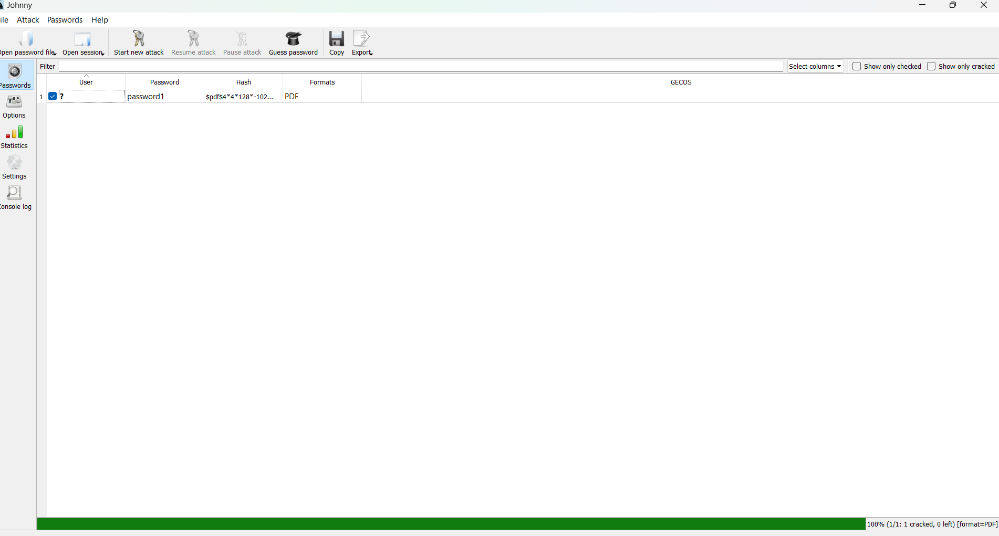
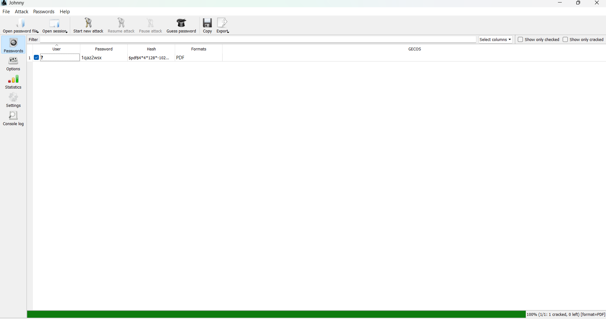
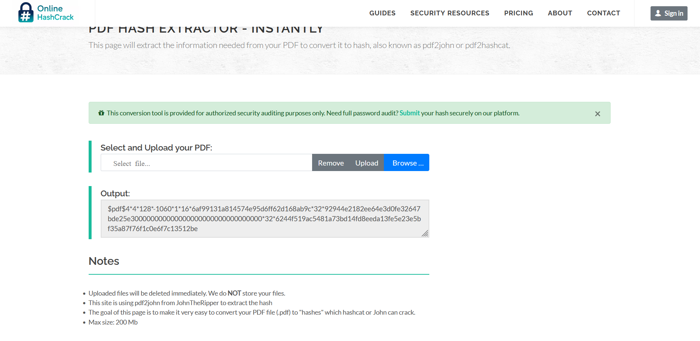
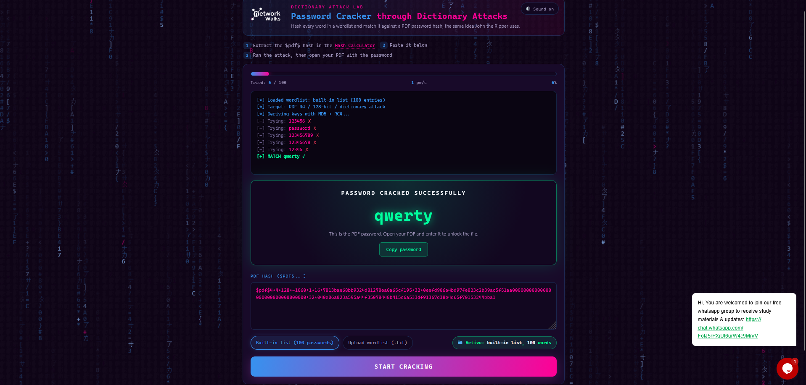
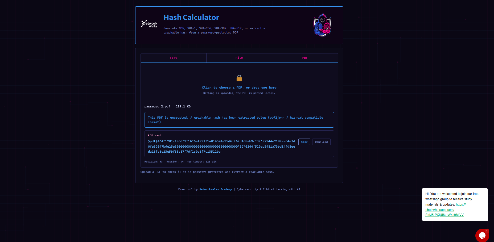
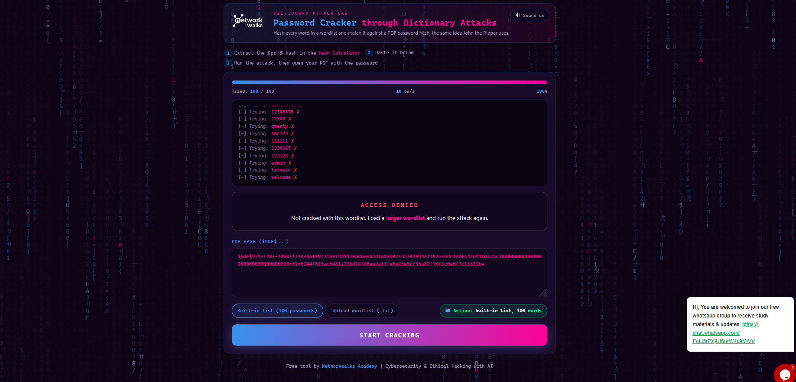

# Week 3 – Password Cracking with JTR and Networkwalks Tools

## Cybersecurity & Ethical Hacking Internship

### Overview

This week's practical activities focused on **password security, password recovery, PDF protection, hashing, and password-cracking techniques** using John the Ripper (JTR) and Networkwalks password-cracking tools.

The exercises were performed in a controlled learning environment for cybersecurity and ethical-hacking training.

---

## Project Modules

### W3-PM1 – Password Cracking with John the Ripper

The first task focused on using **John the Ripper (JTR)** and **Johnny GUI** to recover the password of a password-protected PDF.

The Networkwalks task sheet explains that JTR can be used to test password strength and recover passwords from protected files such as PDFs, ZIP files, and Office documents.

### Activities Performed

1. Obtained the assigned password-protected PDF.
2. Extracted the PDF password hash.
3. Saved the extracted hash in a text file.
4. Loaded the hash into John the Ripper/Johnny.
5. Started the password-cracking process.
6. Recovered the PDF password.
7. Used the recovered password to open the protected PDF.

The assigned workflow involved obtaining the PDF hash, saving it in the appropriate format, loading it into Johnny, and starting a new attack.

### Evidence

Screenshots are included in this repository to demonstrate the practical steps and successful password recovery.








> **Note:** Passwords and other sensitive information should be redacted from public screenshots where necessary.

---

## W3-PM2 – Password Cracking with Networkwalks Tools

The second task focused on using the **Networkwalks Hash Calculator** and **Password Cracker** through a web browser.

The task workflow involved extracting the PDF hash with the Hash Calculator and submitting the hash to the Password Cracker to attempt password recovery.

### Activities Performed

1. Obtained the assigned encrypted PDF.
2. Uploaded the PDF to the Networkwalks Hash Calculator.
3. Extracted the PDF hash beginning with `$pdf$`.
4. Copied the complete hash.
5. Submitted the hash to the Networkwalks Password Cracker.
6. Started the password-recovery process.
7. Verified the recovered password by opening the protected PDF.

The task instructions specifically require copying the complete hash and submitting it to the Password Cracker before waiting for the recovered password.

---

# Additional Practical Exercise – Self-Created Password-Protected PDF

As an additional practical exercise, I created my own PDF document and protected it with a password.

I then used **John the Ripper** to perform password recovery against the protected PDF in the controlled lab environment.

### Steps Performed

1. Created a PDF document.
2. Applied password protection to the PDF.
3. Generated/extracted the required PDF hash.
4. Prepared the hash for John the Ripper.
5. Loaded the hash into John.
6. Performed the password-recovery attack.
7. Successfully recovered the password.
8. Verified the recovered password by opening the protected PDF.

### Result

**John the Ripper successfully recovered the password of the self-created protected PDF.**

A screenshot showing the successful password recovery is included in the repository as practical evidence.

**Evidence:**




---

# Networkwalks Tool Limitation – Additional Observation

During the additional testing, I also attempted to use the Networkwalks Password Cracker against another password-protected PDF.

The tool was unable to recover the password because the password was outside the tool's available **100-word checking range**.

This demonstrated an important practical limitation of a restricted password-cracking tool: successful recovery depends not only on the password itself but also on the words/candidates available to the cracking process.

For a password outside the available checking range, the tool would need to be supplied with an appropriate **wordlist** containing suitable password candidates before the test could effectively continue.

**Evidence:**



### Security Learning

This exercise demonstrated why:

* Short/common passwords are easier to recover.
* Password complexity affects cracking time.
* The available candidate/wordlist has a direct effect on dictionary-based password recovery.
* Different password-cracking tools may have different capabilities and limitations.
* Password-protected files should use strong, unique passwords.

The Networkwalks task itself notes that password recovery time depends on password simplicity or complexity.

---

# Key Learning Outcomes

Through these activities, I gained practical experience with:

* John the Ripper (JTR)
* Johnny GUI
* PDF password protection
* PDF hash extraction
* Password hashes
* Dictionary/password recovery concepts
* Password-cracking workflows
* Wordlist limitations
* Password-strength considerations
* Verification of recovered passwords
* Security testing in a controlled environment

---

# Security Perspective

From a defensive security perspective, password-cracking exercises demonstrate the importance of using strong and unique passwords.

A weak or predictable password may be recovered relatively quickly when an attacker has access to the required password hash and suitable password candidates.

The objective of this exercise was educational: to understand password security and demonstrate why stronger password practices are important.

---

# Repository Evidence

```text
Week3-Password-Cracking/
│
├── README.md
│
├── screenshots/
│   ├── jtr/
│   │   ├── pdf-hash.png
│   │   ├── john-setup.png
│   │   └── john-password-cracked.png
│   │
│   └── networkwalks/
│       ├── hash-calculator.png
│       └── password-cracker.png
│
└── evidence/
    └── additional-pdf-jtr-crack.png
```

> Screenshots containing passwords, private information, personal files, or other sensitive information should be redacted before being published publicly.

---

## Ethical Use

All activities documented in this repository were performed as part of a controlled cybersecurity learning environment.

Password-cracking techniques should only be used on files, systems, accounts, and data that you own or have explicit authorization to test.

Unauthorized password recovery or access to other people's protected data is not permitted.

## Training Reference

Networkwalks – Cybersecurity & Ethical Hacking Project Tasks

**Week 3 Modules:**

* Project Module 1 – Password Cracking with JTR
* Project Module 2 – Password Cracking with Networkwalks Tools
